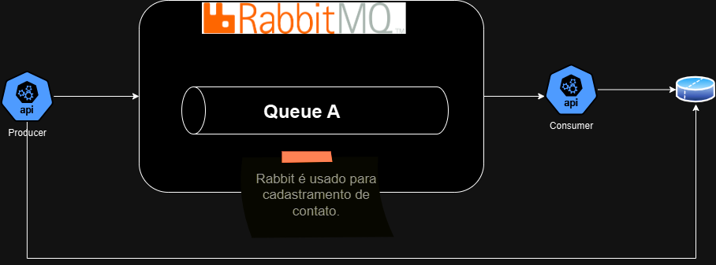

# Tech Challenger - Microsserviços e Mensageria

# Introdução

Na fase anterior do Tech Challenge, desenvolvemos um aplicativo .NET para cadastro de contatos regionais, com funcionalidades de adicionar, consultar, atualizar e excluir contatos, utilizando Entity Framework Core ou Dapper para persistência de dados e implementando validações de dados. Além da criação de CI/CD e monitoramento.

Nesta terceira fase, vamos aprimorar o projeto através de microsserviços e comunicação por mensageria. Mantendo também o funcionamento da fase anterior.

# Objetivos

- **Utilizar Kubernates:**

# Tecnologias Utilizadas:

- **.NET 8**: Framework para construção da Minimal API.
- **C#**: Linguagem de programação usada no desenvolvimento do projeto.
- **Entity Framework**: ORM (Object-Relational Mapping) utilizado para interagir com o banco de dados.
- **xUnit**: Framework de testes utilizado para realizar testes unitários.
- **Postegress**: Banco de dados relacional usado para armazenar os dados da aplicação.
- **Prometheus**: Ferramenta projetada para coletar, armazenar e consultar métricas de sistemas e serviços..
- **Grafana**: Plataforma de análise e visualização de código aberto que permite criar dashboards dinâmicos e interativos.
- **Kubernates**:

# Vídeo explicativo

